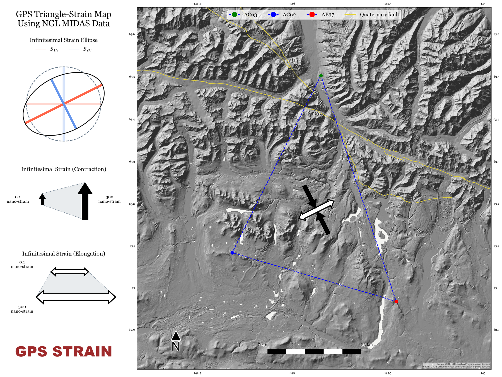
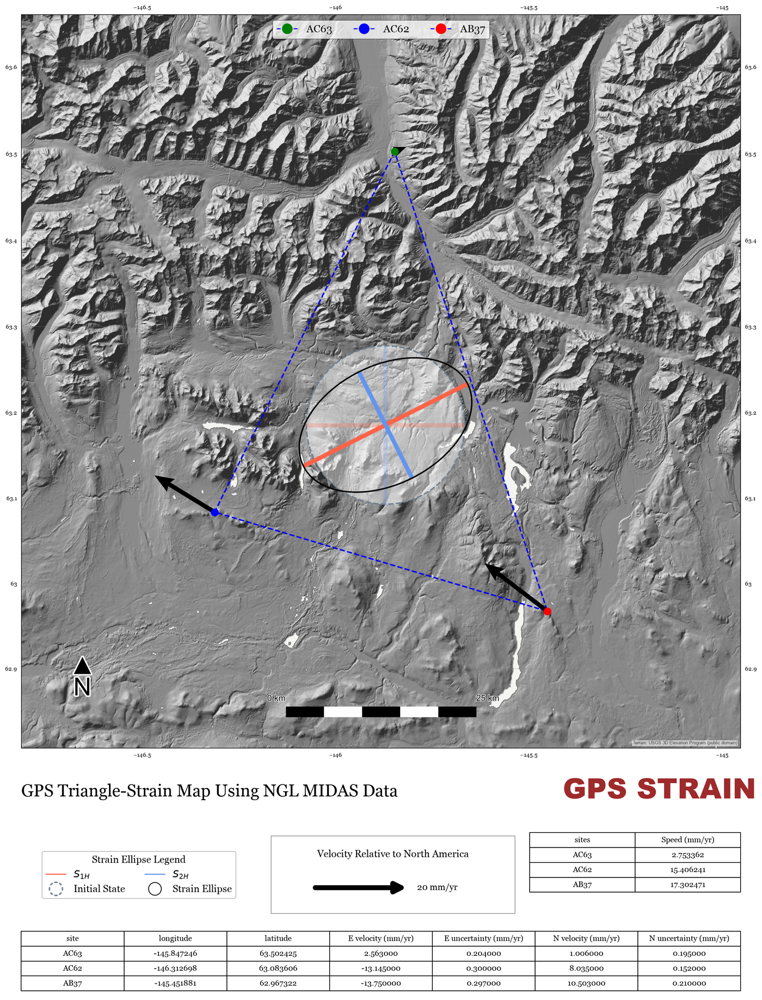
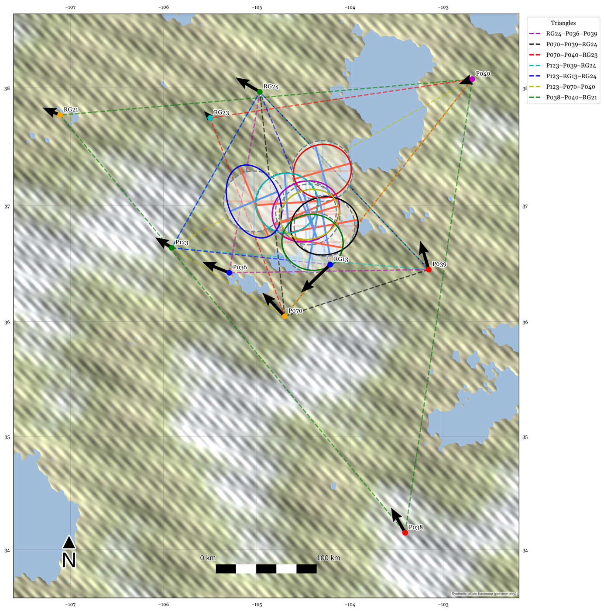

# GPS_Strain

**Horizontal infinitesimal strain rate from GPS/GNSS station velocities**: a Python implementation of the triangle strain method of [Vincent Cronin](https://croninprojects.org/Vince/) (Baylor) and Phil Resor (Wesleyan), taught in the SERC/GETSI module [*GPS, Strain, and Earthquakes*](https://serc.carleton.edu/getsi/teaching_materials/gps_strain/index.html).

> **Version 2 (in development).** The 2020 code no longer installed or ran, and it computed velocities incorrectly (see [docs/AUDIT_2020.md](docs/AUDIT_2020.md)). The core has been rebuilt and is validated against Cronin & Resor's published worked example. The original file is kept in `legacy/`.

Give it three or more stations and it reports the following, then draws the two classic map sheets (a strain-symbol map and a strain-ellipse/velocity map):

- the translation;
- the rotation;
- the strain-rate tensor;
- the principal strain rates **e1H / e2H** and their azimuths **S1H / S2H**;
- the maximum shear and area strain;
- 1σ uncertainties for all of the above.

<p align="center"></p>
<p align="center"></p>

<p align="center"></p>

<sub>Top: the Alaska triangle AC63–AC62–AB37 from <code>gps-strain AC63 AC62 AB37 -o alaska --format png</code>, with current NGL MIDAS velocities and USGS 3DEP terrain. Bottom: the 2021 Raton, NM network, rendered offline, so its terrain is the made-up preview relief (<code>--basemap synthetic</code>), not the real landscape.</sub>

## Install

```bash
pip install git+https://github.com/The-Geology-Guy/GPS_Strain
```

Requires Python ≥ 3.11 with numpy, pandas, matplotlib, requests and Pillow. No cartopy or GDAL is needed.

## Use

Command line:

```bash
# velocities from the Nevada Geodetic Laboratory (MIDAS, North America fixed)
# writes tahoe_symbol.pdf and tahoe_strain.pdf
gps-strain P146 P149 P150 -o tahoe

# USGS topographic map tiles instead of the grey hillshade (US only)
gps-strain P146 P149 P150 -o tahoe --basemap usgs-topo

# the sheets carry a block-letter "GPS STRAIN" wordmark; swap in your own logo (file or URL)
gps-strain P146 P149 P150 -o tahoe --logo my_logo.png

# "increase visibility": thicker lines and arrows with white edges, white panels behind
# the scale bar and north arrow (easier to read over dark relief)
gps-strain P146 P149 P150 -o tahoe --visibility

# mapped Quaternary faults (USGS; GEM outside the US) are drawn by default, between the
# terrain and the strain symbols; leave them off with --no-faults
gps-strain P146 P149 P150 -o tahoe --no-faults

# which stations are near a point?
gps-strain --near 38.22 -122.31 --radius 30

# your own velocities (mm/yr): columns site, lat, lon, ve, vn, sig_e, sig_n
gps-strain --table examples/cronin_example.csv -o example

# several triangles on one map (like the 2021 Raton, NM study)
gps-strain --triangles RG24,P036,P039 P070,P039,RG24 P123,RG13,RG24 -o raton

# reproduce the classic GETSI spreadsheet (UTM) instead of the local ENU frame
gps-strain --table examples/cronin_example.csv --frame utm
```

Python:

```python
from gps_strain import data, compute_strain, plotting

midas = data.load_midas("NA")            # cached for a week
sta = data.select_sites(midas, ["P146", "P149", "P150"])
r = compute_strain(sta)                  # frame="enu" (default) or "utm"
print(r.report())
r.e1, r.e2, r.azimuth_s1, r.max_shear, r.rotation, r.sigma, r.mc
plotting.symbol_map(r, sta, "symbol.pdf")
plotting.strain_map(r, sta, "strain.pdf", basemap="usgs-topo")
plotting.network_map([r1, r2, r3], [t1, t2, t3], "network.pdf", kind="ellipse")  # or kind="symbol"
```

Original 2020–2021 figures, for comparison, are in [docs/reference_2020/](docs/reference_2020/).

## Basemaps

| `--basemap` | Look | Coverage / licence |
|---|---|---|
| `hillshade` (default) | Grey shaded relief computed from elevation data, the same look as GEOSLAM's printed maps. Water is left pale. | USGS 3DEP in the US (public domain), Copernicus GLO-30/90 elsewhere (free licence, credit printed on the map). No key, no print limits. |
| `hillshade-3dep`, `hillshade-copernicus` | The same, forcing one elevation source | As above |
| `usgs-relief`, `usgs-topo`, `usgs-imagery` | USGS The National Map tiles (the same maps geoslam.org shows) | Public domain, no key; **US and territories only** |
| `synthetic` | Grey hillshade of made-up terrain, for offline previews and tests | None (labelled on the map as not real) |
| `none` | No background | |

Elevation downloads and tiles are cached in `~/.cache/gps_strain/` (set `GPS_STRAIN_CACHE` to move it). If the download fails, the map is still drawn on a plain background with a note.

## Tests

```bash
pip install -e .[test]
pytest
```

## Documentation

- [docs/METHOD.md](docs/METHOD.md): the math and geophysics, step by step, with references.
- [docs/AUDIT_2020.md](docs/AUDIT_2020.md): what was wrong with the 2020 version.
- [docs/ROADMAP.md](docs/ROADMAP.md): next steps, including the Mac/PC desktop app and gps-strain.org.
- [docs/research/](docs/research/): full research notes with source URLs, including the cost analysis.

## Data and credits

- **Method:** Cronin, V. S., & Resor, P. G. (2021), *Algorithm for triangle strain*; Cronin (2021), *Primer on infinitesimal strain analysis*.
- **Faults:** USGS Quaternary Fault and Fold Database (public domain); outside the US, GEM Global Active Faults Database (Styron & Pagani 2020, CC BY-SA 4.0).
- **Default velocities:** Nevada Geodetic Laboratory MIDAS. Please cite Blewitt, Hammond & Kreemer (2018), *Eos* 99, doi:10.1029/2018EO104623, and Blewitt et al. (2016), *JGR* 121, doi:10.1002/2015JB012552.
- **Python package:** Luke Pajer ([ORCID 0000-0002-5218-7650](https://orcid.org/0000-0002-5218-7650)).

MIT License. Issues and contributions are welcome; see the [code of conduct](CODE_OF_CONDUCT.md).
