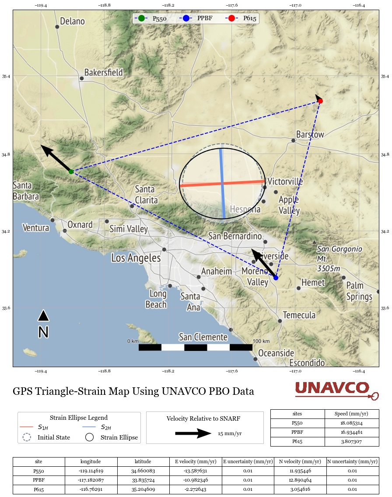

# GPS and infinitesimal strain analysis (GPS Strain)

Main Project Resources: [PAJER, Luke](mailto:luke.pajer@gmail.com); [CRONIN, Vincent](mailto:vince_cronin@baylor.edu)

_Last Updated: October 2020_

[](https://serc.carleton.edu/getsi/teaching_materials/gps_strain/unit4.html)
[](/LICENSE)
[](https://jupyterlab.readthedocs.io/en/stable/)
[](https://jupyterlab.readthedocs.io/en/stable/)

-----

# PROJECT OVERVIEW

The `GPS_Strain` Python package is a simple translation of the methods developed by Vince Cronin and Phil Resor. The purpose of this package is to make the method available to those who are interested in GPS and infinitesimal strain analysis and are more comfortable using Python.

_From [the GETSI teaching materials](https://serc.carleton.edu/getsi/teaching_materials/gps_strain/unit4.html):_

> This module was designed for structural geology courses but can also be successfully used in geophysics, tectonics, or geohazards courses or possibly even a physics or engineering course seeking practical applications. It can be done at almost any point during the term. The module assumes that students have had a basic physical geology introduction to plate tectonics, faults, and earthquakes.

In addition to teaching purposes, the actual analysis can be used for other assessments. See the Victoria E. Worrell thesis titled ["The Seismo-Lineament Analysis Method (SLAM) Applied to the South Napa Earthquake and Antecedent Events"](https://baylor-ir.tdl.org/bitstream/handle/2104/9796/WORRELL-THESIS-2016.pdf?sequence=1&isAllowed=y) to see an example of how this method may be used in practice. 

If there are any issues or concerns with the python package, please reach out to [Luke Pajer](mailto:luke.pajer@gmail.com). For any questions regarding the GPS strain method, please reach out to [Vince Cronin](mailto:vince_cronin@baylor.edu).

-----

# CONTRIBUTORS

This project is an open project, and contributions are welcome from any individual. All contributors to this project are bound by a [code of conduct](/CODE_OF_CONDUCT.md). Please review and follow this code of conduct as part of your contribution.

#### Contributions to the GPS_Strain Python Package
- [Luke Pajer](mailto:luke.pajer@gmail.com) [](https://orcid.org/0000-0002-5218-7650)

#### GPS and infinitesimal strain analysis method Authors/Developers
- [Vince Cronin](mailto:vince_cronin@baylor.edu) [](https://orcid.org/0000-0002-3069-6470)
- [Phil Resor](mailto:presor@wesleyan.edu) [](https://orcid.org/0000-0003-3071-5085)

-----

# DATA RESOURCES

- [UNAVCO Web Services](https://www.unavco.org/data/web-services/documentation/documentation.html#!/GNSS47GPS/getPositionByStationId) is used for the station locations and relative station velocity.
- [Stamen Map Tile Sets](http://maps.stamen.com/#watercolor/12/37.7706/-122.3782) are used to generate the maps in this package. The Stamen map tile sets are copyright Stamen Design, under a Creative Commons Attribution (CC BY 3.0) license.

-----

# HOW TO USE THIS REPOSITORY

## TABLE OF CONTENTS

### &nbsp; [1&nbsp;&nbsp;&nbsp; GPS STRAIN CALCULATOR OVERVIEW](#section1)

#### &nbsp;&nbsp;&nbsp;&nbsp;&nbsp;&nbsp;&nbsp;&nbsp;&nbsp; [1.1 &nbsp;&nbsp;&#8239; Query UNAVCO API](#section1.1)

##### &nbsp;&nbsp;&nbsp;&nbsp;&nbsp;&nbsp;&nbsp;&nbsp;&nbsp;&nbsp;&nbsp;&nbsp;&nbsp;&nbsp;&nbsp;&nbsp;&nbsp;&nbsp;&nbsp;&nbsp;&nbsp; [1.1.0 &nbsp;&nbsp; Query Sites Located in Alaska](#section1.1.0)
##### &nbsp;&nbsp;&nbsp;&nbsp;&nbsp;&nbsp;&nbsp;&nbsp;&nbsp;&nbsp;&nbsp;&nbsp;&nbsp;&nbsp;&nbsp;&nbsp;&nbsp;&nbsp;&nbsp;&nbsp;&nbsp; [1.1.1 &nbsp;&nbsp;&#8239; Get Site Data for Individual Sites](#section1.1.1)

#### &nbsp;&nbsp;&nbsp;&nbsp;&nbsp;&nbsp;&nbsp;&nbsp;&nbsp; [1.2 &nbsp;&nbsp;&#8239; Process Site Data](#section1.2)

##### &nbsp;&nbsp;&nbsp;&nbsp;&nbsp;&nbsp;&nbsp;&nbsp;&nbsp;&nbsp;&nbsp;&nbsp;&nbsp;&nbsp;&nbsp;&nbsp;&nbsp;&nbsp;&nbsp;&nbsp;&nbsp; [1.2.0 &nbsp;&nbsp; Instantiate the 'strain_data' class to be used in Data Analysis](#section1.2.0)
##### &nbsp;&nbsp;&nbsp;&nbsp;&nbsp;&nbsp;&nbsp;&nbsp;&nbsp;&nbsp;&nbsp;&nbsp;&nbsp;&nbsp;&nbsp;&nbsp;&nbsp;&nbsp;&nbsp;&nbsp;&nbsp; [1.2.1 &nbsp;&nbsp;&#8239; Pull Strain Data](#section1.2.1)
##### &nbsp;&nbsp;&nbsp;&nbsp;&nbsp;&nbsp;&nbsp;&nbsp;&nbsp;&nbsp;&nbsp;&nbsp;&nbsp;&nbsp;&nbsp;&nbsp;&nbsp;&nbsp;&nbsp;&nbsp;&nbsp; [1.2.2 &nbsp;&nbsp; Find the Left Stretch Tensor](#section1.2.2)

#### &nbsp;&nbsp;&nbsp;&nbsp;&nbsp;&nbsp;&nbsp;&nbsp;&nbsp; [1.3 &nbsp;&nbsp;&#8239; Vizualize the Data](#section1.3)

##### &nbsp;&nbsp;&nbsp;&nbsp;&nbsp;&nbsp;&nbsp;&nbsp;&nbsp;&nbsp;&nbsp;&nbsp;&nbsp;&nbsp;&nbsp;&nbsp;&nbsp;&nbsp;&nbsp;&nbsp;&nbsp; [1.3.0 &nbsp;&nbsp; Instantiate the 'strain_viz' class](#section1.3.0)
##### &nbsp;&nbsp;&nbsp;&nbsp;&nbsp;&nbsp;&nbsp;&nbsp;&nbsp;&nbsp;&nbsp;&nbsp;&nbsp;&nbsp;&nbsp;&nbsp;&nbsp;&nbsp;&nbsp;&nbsp;&nbsp; [1.3.1 &nbsp;&nbsp;&#8239; Visualize the Strain Ellipse](#section1.3.1)
##### &nbsp;&nbsp;&nbsp;&nbsp;&nbsp;&nbsp;&nbsp;&nbsp;&nbsp;&nbsp;&nbsp;&nbsp;&nbsp;&nbsp;&nbsp;&nbsp;&nbsp;&nbsp;&nbsp;&nbsp;&nbsp; [1.3.2 &nbsp;&nbsp; View the Strain Ellipse on a Map via Cartopy](#section1.3.2)
##### &nbsp;&nbsp;&nbsp;&nbsp;&nbsp;&nbsp;&nbsp;&nbsp;&nbsp;&nbsp;&nbsp;&nbsp;&nbsp;&nbsp;&nbsp;&nbsp;&nbsp;&nbsp;&nbsp;&nbsp;&nbsp; [1.3.3 &nbsp;&nbsp; Strain Ellipse Map with Legend and Data](#section1.3.3)
##### &nbsp;&nbsp;&nbsp;&nbsp;&nbsp;&nbsp;&nbsp;&nbsp;&nbsp;&nbsp;&nbsp;&nbsp;&nbsp;&nbsp;&nbsp;&nbsp;&nbsp;&nbsp;&nbsp;&nbsp;&nbsp; [1.3.4 &nbsp;&nbsp; Plot the Map Symbol](#section1.3.4)
##### &nbsp;&nbsp;&nbsp;&nbsp;&nbsp;&nbsp;&nbsp;&nbsp;&nbsp;&nbsp;&nbsp;&nbsp;&nbsp;&nbsp;&nbsp;&nbsp;&nbsp;&nbsp;&nbsp;&nbsp;&nbsp; [1.3.5 &nbsp;&nbsp; View the Map Symbol on a Map via Cartopy](#section1.3.5)
##### &nbsp;&nbsp;&nbsp;&nbsp;&nbsp;&nbsp;&nbsp;&nbsp;&nbsp;&nbsp;&nbsp;&nbsp;&nbsp;&nbsp;&nbsp;&nbsp;&nbsp;&nbsp;&nbsp;&nbsp;&nbsp; [1.3.6 &nbsp;&nbsp; Map Symbol plotted with Legend and Strain Ellipse](#section1.3.6)

### &nbsp; [2&nbsp;&nbsp;&nbsp; EXAMPLES USING UNAVCO DATA](#section2)

#### &nbsp;&nbsp;&nbsp;&nbsp;&nbsp;&nbsp;&nbsp;&nbsp;&nbsp; [2.1 &nbsp;&nbsp;&#8239; Site Selection](#section2.1)

##### &nbsp;&nbsp;&nbsp;&nbsp;&nbsp;&nbsp;&nbsp;&nbsp;&nbsp;&nbsp;&nbsp;&nbsp;&nbsp;&nbsp;&nbsp;&nbsp;&nbsp;&nbsp;&nbsp;&nbsp;&nbsp; [2.1.0 &nbsp;&nbsp; California](#section2.2.0)
##### &nbsp;&nbsp;&nbsp;&nbsp;&nbsp;&nbsp;&nbsp;&nbsp;&nbsp;&nbsp;&nbsp;&nbsp;&nbsp;&nbsp;&nbsp;&nbsp;&nbsp;&nbsp;&nbsp;&nbsp;&nbsp; [2.1.1 &nbsp;&nbsp;&#8239; Utah](#section2.2.1)

#### &nbsp;&nbsp;&nbsp;&nbsp;&nbsp;&nbsp;&nbsp;&nbsp;&nbsp; [2.2 &nbsp;&nbsp; Mapping the Sites](#section2.2)

##### &nbsp;&nbsp;&nbsp;&nbsp;&nbsp;&nbsp;&nbsp;&nbsp;&nbsp;&nbsp;&nbsp;&nbsp;&nbsp;&nbsp;&nbsp;&nbsp;&nbsp;&nbsp;&nbsp;&nbsp;&nbsp; [2.2.0 &nbsp;&nbsp; GPS Sites ['AC11', 'AC44', 'AC53']](#section2.2.0)
##### &nbsp;&nbsp;&nbsp;&nbsp;&nbsp;&nbsp;&nbsp;&nbsp;&nbsp;&nbsp;&nbsp;&nbsp;&nbsp;&nbsp;&nbsp;&nbsp;&nbsp;&nbsp;&nbsp;&nbsp;&nbsp; [2.2.1 &nbsp;&nbsp;&#8239; GPS Sites ['P550', 'PPBF', 'P615']](#section2.2.1)
##### &nbsp;&nbsp;&nbsp;&nbsp;&nbsp;&nbsp;&nbsp;&nbsp;&nbsp;&nbsp;&nbsp;&nbsp;&nbsp;&nbsp;&nbsp;&nbsp;&nbsp;&nbsp;&nbsp;&nbsp;&nbsp; [2.2.2 &nbsp;&nbsp; GPS Sites ['P146', 'P142', 'P090']](#section2.2.2)
##### &nbsp;&nbsp;&nbsp;&nbsp;&nbsp;&nbsp;&nbsp;&nbsp;&nbsp;&nbsp;&nbsp;&nbsp;&nbsp;&nbsp;&nbsp;&nbsp;&nbsp;&nbsp;&nbsp;&nbsp;&nbsp; [2.2.3 &nbsp;&nbsp; GPS Sites ['WIKR', 'AC75', 'AC33']](#section2.2.3)
##### &nbsp;&nbsp;&nbsp;&nbsp;&nbsp;&nbsp;&nbsp;&nbsp;&nbsp;&nbsp;&nbsp;&nbsp;&nbsp;&nbsp;&nbsp;&nbsp;&nbsp;&nbsp;&nbsp;&nbsp;&nbsp; [2.2.4 &nbsp;&nbsp; GPS Sites ['P116', 'P088', 'COON']](#section2.2.4)

### &nbsp; [3&nbsp;&nbsp;&nbsp; DOCUMENTATION](#section3)  

#### &nbsp;&nbsp;&nbsp;&nbsp;&nbsp;&nbsp;&nbsp;&nbsp;&nbsp; [3.1 &nbsp;&nbsp;&#8239; Query Unavco Data](#section3.1)

#### &nbsp;&nbsp;&nbsp;&nbsp;&nbsp;&nbsp;&nbsp;&nbsp;&nbsp; [3.2 &nbsp;&nbsp; Calculate Infinitesimal Strain Data](#section3.2)

#### &nbsp;&nbsp;&nbsp;&nbsp;&nbsp;&nbsp;&nbsp;&nbsp;&nbsp; [3.3 &nbsp;&nbsp; Plotting the Site Data](#section3.3)

### &nbsp;&nbsp;&nbsp;&nbsp;&nbsp;&nbsp;&nbsp; [REFERENCES](#section9)

## <a name="section1">1&nbsp;&nbsp;&nbsp;&#8239; GPS STRAIN CALCULATOR OVERVIEW</a>

> _The process of the entire project is taken from the “Applying GPS strain and earthquake hazard analyses to different regions” course. More information on the full course may be found on [the serc Carlton website](https://serc.carleton.edu/getsi/teaching_materials/gps_strain/overview.html)._

> _The Stamen map tile sets are copyright Stamen Design, under a Creative Commons Attribution (CC BY 3.0) license._

### <a name="section1.1">1.1&nbsp;&nbsp;&#8239; Query UNAVCO API</a>

``` python
from geo_strain_calculator_local_v2 import unavco_data

``` 

### <a name="section1.1.0">1.1.0&nbsp;&nbsp; Query Sites Located in Alaska</a>

``` python
# This query used approximate latitudes and longitudes that encompass Alaska 
# Lat/Lon source: https://gist.github.com/jakebathman/719e8416191ba14bb6e700fc2d5fccc5
alaska_sites = unavco_data().get_stations(-169.9146000000, -129.993000000, 52.596400000, 71.523200000)

# Show the site data as a pandas dataframe
alaska_sites

```


### <a name="section1.1.1">1.1.1&nbsp;&nbsp;&#8239; Get Site Data for Individual Sites</a>

``` python
# Define the three GPS Sites of interest
sites = ['AC63', 'AC62', 'AB37']

# Use the 'site_data' function under the 'unavco_data' class to get the site data 
# This will provide the mean velocity of the sites over the previous 365 days
our_sites = unavco_data().site_data(sites)

# Show the site data as a pandas dataframe
our_sites

```

> 

### <a name="section1.2">1.2&nbsp;&nbsp;&#8239; Process Site Data</a>

``` python
from geo_strain_calculator_local_v2 import strain_data

```

### <a name="section1.2.0">1.2.0&nbsp;&nbsp; Instantiate the 'strain_data' class to be used in Data Analysis</a>

``` python
# Instantiate strain_data using the sites of interest
strain_output = strain_data(our_sites).output_data()

```


### <a name="section1.2.1">1.2.1&nbsp;&nbsp;&#8239; Pull Strain Data</a>

``` python
# Show the primary data table (this table is in reference to Dr. Vincent Cronin's course excel file)
strain_output.primary_data

```

> 

### <a name="section1.2.2">1.2.2&nbsp;&nbsp; Find the Left Stretch Tensor</a>

``` python
# Show the left stretch tensor that will be used when visualizing the data
strain_output.left_stretch_tensor

```
> [output]: array([[1.07685512, 0.12006416], [0.12006416, 0.79994878]])

### <a name="section1.3">1.3&nbsp;&nbsp;&#8239; Vizualize the Data</a>

``` python
from geo_strain_calculator_local_v2 import strain_viz

```

### <a name="section1.3.0">1.3.0&nbsp;&nbsp; Instantiate the 'strain_viz' class</a>

``` python
# Instantiate the strain_viz class to use the site data queried earlier
strain_viz_ = strain_viz(our_sites)

```

### <a name="section1.3.1">1.3.1&nbsp;&nbsp;&#8239; Visualize the Strain Ellipse</a>

``` python
# Visualize only the strain ellipse
strain_viz_.def_ellipse(V=strain_output.left_stretch_tensor)

```


### <a name="section1.3.2">1.3.2&nbsp;&nbsp; View the Strain Ellipse on a Map via Cartopy</a>

``` python
# Visualize the strain ellipse as it is on a cartopy generated map
strain_viz_.ellipse_plot(V=strain_output.left_stretch_tensor, bounds=0.125)

```


### <a name="section1.3.3">1.3.3&nbsp;&nbsp; Strain Ellipse Map with Legend and Data</a>

``` python
# Show a strain ellipse map with more information and auto-generated components
strain_viz_.strain_map_full(V=strain_output.left_stretch_tensor, tiler_size=10, bounds=0.125)

```

<p align="center"></p>

### <a name="section1.3.4">1.3.4&nbsp;&nbsp; Plot the Map Symbol</a>

``` python
# Plot the map symbol, the e1_2 values are the max and min horizontal extensions
strain_viz_.map_symbol(strain_output.e1_2[0], strain_output.e1_2[1], rot=-strain_output.e2_azi)

```


#### All possible symbols based on $e_{1H}$ and $e_{2H}$


### <a name="section1.3.5">1.3.5&nbsp;&nbsp; View the Map Symbol on a Map via Cartopy</a>

``` python
# View the map symbol on a cartopy generated map
strain_viz_.symbol_map(e1=strain_output.e1_2[0], e2=strain_output.e1_2[1], 
                      e_rot=-strain_output.e2_azi, bounds=0.125)

```


### <a name="section1.3.6">1.3.6&nbsp;&nbsp; Map Symbol plotted with Legend and Strain Ellipse</a>

``` python
# Plot the entire map with components. 
# Set the tiler size higher for finished products.
strain_viz_.symbol_map_full(V=strain_output.left_stretch_tensor, tiler_size=10, 
                           e1=strain_output.e1_2[0], e2=strain_output.e1_2[1], 
                           e_rot=-strain_output.e2_azi, bounds=0.125)

```


## <a name="section2">2&nbsp;&nbsp;&nbsp; EXAMPLES USING UNAVCO DATA</a>

> _The process of the entire project is taken from the “Applying GPS strain and earthquake hazard analyses to different regions” course. More information on the full course may be found on [the serc Carlton website](https://serc.carleton.edu/getsi/teaching_materials/gps_strain/overview.html)._

### <a name="section2.1">2.1&nbsp;&nbsp;&#8239; Site Selection</a>

### <a name="section2.1.0">2.1.0&nbsp;&nbsp; California</a>

``` python
# This query used approximate latitudes and longitudes that encompass Alaska 
# (https://gist.github.com/jakebathman/719e8416191ba14bb6e700fc2d5fccc5)
california_sites = unavco_data().get_stations(-124.6509000000, -114.1315000000, 32.512100000, 42.012600000)

# Show the site data as a pandas dataframe
california_sites

```


### <a name="section2.1.1">2.1.1&nbsp;&nbsp;&#8239; Utah</a>

``` python
# This query used approximate latitudes and longitudes that encompass Alaska 
# (https://gist.github.com/jakebathman/719e8416191ba14bb6e700fc2d5fccc5)
utah_sites = unavco_data().get_stations(-114.0504000000, -109.0462000000, 36.998200000, 41.999300000)

# Show the site data as a pandas dataframe
utah_sites

```


### <a name="section2.2">2.2&nbsp;&nbsp;&#8239; Mapping the Sites</a>

### <a name="section2.2.0">2.2.0&nbsp;&nbsp; GPS Sites ['AC11', 'AC44', 'AC53']</a>

``` python
# Define the three GPS Sites of interest
sites = ['AC11', 'AC44', 'AC53']

# Use the 'site_data' function under the 'unavco_data' class to get the site data 
# This will provide the mean velocity of the sites over the previous 365 days
our_sites = unavco_data().site_data(sites)

# Instantiate strain_data using the sites of interest
strain_output = strain_data(our_sites).output_data()

# Show the primary data table (this table is in reference to Dr. Vincent Cronin's course excel file)
strain_output.primary_data

``` 

>

``` python
# Instantiate the strain_viz class to use the site data queried earlier
strain_viz_0 = strain_viz(our_sites)

# Show a strain ellipse map with more information and auto-generated components
strain_viz_0.strain_map_full(V=strain_output.left_stretch_tensor, tiler_size=10, size=5, 
                             label='5 mm/yr', scale_arrow=25, hei_=2, length=35, bounds=0.275)

```

<p align="center"></p>

``` python
# Plot the entire map with components.
strain_viz_0.symbol_map_full(V=strain_output.left_stretch_tensor, 
                             e1=strain_output.e1_2[0], e2=strain_output.e1_2[1], 
                             e_rot=-strain_output.e2_azi, tiler_size=10, 
                             old_range=[0.1, 100], max_strain=100, min_strain=0.1,
                             hei_=2, size=5, label='5 mm/yr', scale_arrow=25, 
                             length=35, bounds=0.275)

```


### <a name="section2.2.1">2.2.1&nbsp;&nbsp;&#8239; GPS Sites ['P550', 'PPBF', 'P615']</a>

``` python
# Define the three GPS Sites of interest
sites = ['P550', 'PPBF', 'P615']

# Use the 'site_data' function under the 'unavco_data' class to get the site data 
# This will provide the mean velocity of the sites over the previous 365 days
our_sites = unavco_data().site_data(sites)

# Instantiate strain_data using the sites of interest
strain_output = strain_data(our_sites).output_data()

# Show the primary data table (this table is in reference to Dr. Vincent Cronin's course excel file)
strain_output.primary_data

```

>

``` python
# Instantiate the strain_viz class to use the site data queried earlier
strain_viz_1 = strain_viz(our_sites)

# Show a strain ellipse map with more information and auto-generated components
strain_viz_1.strain_map_full(V=strain_output.left_stretch_tensor, tiler_size=8, map_tile_type='terrain', 
                             size=15, label='15 mm/yr', scale_arrow=70, hei_=2, length=100, bounds=0.7)

```
<p align="center"></p>


``` python
# Plot the entire map with components.
strain_viz_1.symbol_map_full(V=strain_output.left_stretch_tensor, 
                             e1=strain_output.e1_2[0], e2=strain_output.e1_2[1], 
                             e_rot=-strain_output.e2_azi, tiler_size=8, 
                             old_range=[0.1, 100], max_strain=100, min_strain=0.1,
                             map_tile_type='terrain', size=15, label='15 mm/yr', 
                             scale_arrow=70, hei_=2, length=100, bounds=0.7)

```


### <a name="section2.2.2">2.2.2&nbsp;&nbsp; GPS Sites ['P146', 'P142', 'P090']</a>

``` python
# Define the three GPS Sites of interest
sites = ['P146', 'P142', 'P090']

# Use the 'site_data' function under the 'unavco_data' class to get the site data 
# This will provide the mean velocity of the sites over the previous 365 days
our_sites = unavco_data().site_data(sites)

# Instantiate strain_data using the sites of interest
strain_output = strain_data(our_sites).output_data()

# Show the primary data table (this table is in reference to Dr. Vincent Cronin's course excel file)
strain_output.primary_data

```

>

``` python
# Instantiate the strain_viz class to use the site data queried earlier
strain_viz_2 = strain_viz(our_sites)

# Show a strain ellipse map with more information and auto-generated components
strain_viz_2.strain_map_full(V=strain_output.left_stretch_tensor, tiler_size=10, size=5, 
                             label='5 mm/yr', scale_arrow=25, length=40, bounds=0.175)

```

<p align="center"></p>

``` python
# Plot the entire map with components.
strain_viz_2.symbol_map_full(V=strain_output.left_stretch_tensor, 
                             e1=strain_output.e1_2[0], e2=strain_output.e1_2[1], 
                             e_rot=-strain_output.e2_azi, tiler_size=10, 
                             old_range=[0.1, 50], max_strain=50, min_strain=0.1,
                             size=5, label='5 mm/yr', scale_arrow=25, 
                             length=40, bounds=0.175)

```


### <a name="section2.2.3">2.2.3&nbsp;&nbsp; GPS Sites ['WIKR', 'AC75', 'AC33']</a>

``` python
# Define the three GPS Sites of interest
sites = ['WIKR', 'AC75', 'AC33']

# Use the 'site_data' function under the 'unavco_data' class to get the site data 
# This will provide the mean velocity of the sites over the previous 365 days
our_sites = unavco_data().site_data(sites)

# Instantiate strain_data using the sites of interest
strain_output = strain_data(our_sites).output_data()

# Show the primary data table (this table is in reference to Dr. Vincent Cronin's course excel file)
strain_output.primary_data

```

>

``` python
# Instantiate the strain_viz class to use the site data queried earlier
strain_viz_3 = strain_viz(our_sites)

# Show a strain ellipse map with more information and auto-generated components
strain_viz_3.strain_map_full(V=strain_output.left_stretch_tensor, tiler_size=10, size=5, label='5 mm/yr', 
                             scale_arrow=25, length=30, bounds=0.2)

```

<p align="center"></p>

``` python
# Plot the entire map with components.
strain_viz_3.symbol_map_full(V=strain_output.left_stretch_tensor, 
                             e1=strain_output.e1_2[0], e2=strain_output.e1_2[1], 
                             e_rot=-strain_output.e2_azi, tiler_size=10, 
                             old_range=[0.1, 100], max_strain=100, min_strain=0.1,
                             size=5, label='5 mm/yr', scale_arrow=25, 
                             scale_loc=(0.5, 0.05), length=30, bounds=0.2)

```


### <a name="section2.2.4">2.2.4&nbsp;&nbsp; GPS Sites ['P116', 'P088', 'COON']</a>

``` python
# Define the three GPS Sites of interest
sites = ['P116', 'P088', 'COON']

# Use the 'site_data' function under the 'unavco_data' class to get the site data 
# This will provide the mean velocity of the sites over the previous 365 days
our_sites = unavco_data().site_data(sites)

# Instantiate strain_data using the sites of interest
strain_output = strain_data(our_sites).output_data()

# Show the primary data table (this table is in reference to Dr. Vincent Cronin's course excel file)
strain_output.primary_data

```

>

``` python
# Instantiate the strain_viz class to use the site data queried earlier
strain_viz_4 = strain_viz(our_sites)

# Show a strain ellipse map with more information and auto-generated components
strain_viz_4.strain_map_full(V=strain_output.left_stretch_tensor, tiler_size=10, size=1, label='1 mm/yr', 
                             scale_arrow=5, map_tile_type='terrain', scale_loc=(0.5, 0.125), 
                             length=15, bounds=0.125)

```

<p align="center"></p>

``` python
# Plot the entire map with components.
strain_viz_4.symbol_map_full(V=strain_output.left_stretch_tensor, 
                             e1=strain_output.e1_2[0], e2=strain_output.e1_2[1], 
                             e_rot=-strain_output.e2_azi, tiler_size=10, 
                             old_range=[0.1, 50], max_strain=50, min_strain=0.1,
                             map_tile_type='terrain', size=1, label='1 mm/yr', 
                             scale_arrow=5, scale_loc=(0.5, 0.13), 
                             length=15, bounds=0.125, save_fig='P116_symbol.jpg')

```


## <a name="section3">3&nbsp;&nbsp;&nbsp; DOCUMENTATION</a>

> _The process of the entire project is taken from the “Applying GPS strain and earthquake hazard analyses to different regions” course. More information on the full course may be found on [the serc Carlton website](https://serc.carleton.edu/getsi/teaching_materials/gps_strain/overview.html)._


### <a name="section3.1">3.1&nbsp;&nbsp;&#8239; Query Unavco Data</a>

#### from `geo_strain_calculator_local_v2` import `unavco_data`

#### unavco_data(\*\*kwargs)
- `start_time` (optional) -- the starting date in format ‘yyyy-mm-dd’
- `end_time` (optional) -- the ending date in format ‘yyyy-mm-dd’

#### unavco_data(\*\*kwargs).get_stations(self, minlon, maxlon, minlat, maxlat)
> This function returns a data table of all GPS sites within the limits of the longitude and latitude given.

- `minlon` -- the minimum longitude
- `maxlon` -- the maximum longitude
- `minlat` -- the minimum latitude
- `maxlat` -- the maximum latitude

#### unavco_data(\*\*kwargs).site_data(self, sites, \*\*kwargs)
> Generates a pandas dataframe with all of the site information

- `sites` (required) -- the three sites of interest in the form of a list

### <a name="section3.2">3.2&nbsp;&nbsp;&#8239; Calculate Infinitesimal Strain Data</a>

#### from geo_strain_calculator_local_v2 import strain_data

#### strain_data(data_unav)
- `data_unav` (required) -- the data to be processed that was generated from the _unavco_data(**kwargs).site_data(self, sites, **kwargs)_ function.

#### strain_data(data_unav).attribute

| **Attribute**                                                                          	| **Description**                                                                 	|
|----------------------------------------------------------------------------------------	|---------------------------------------------------------------------------------	|
| strain_data(data_unav).primary                                                         	| Returns a summary table                                                         	|
| strain_data(data_unav).deformation_matrix                                              	| Returns the deformation matrix                                                  	|
| strain_data(data_unav).left_stretch_tensor                                             	| Returns the left stretch tensor matrix                                          	|
| strain_data(data_unav).right_stretch_tensor                                            	| Returns the right stretch tensor matrix                                         	|
| strain_data(data_unav).S                                                               	| Returns the stretch tensor                                                      	|
| strain_data(data_unav).stretch                                                         	| Returns a matrix with the calculated stretch                                    	|
| strain_data(data_unav).shear                                                           	| Returns a matrix with the calculated shear                                      	|
| strain_data(data_unav).rotation                                                        	| Returns a matrix with the calculated rotation                                   	|
| strain_data(data_unav).l_rads                                                          	| Longitude and Latitude in radians for the sites of interest.                    	|
| strain_data(data_unav).utm_z                                                           	| UTM zones for each site                                                         	|
| strain_data(data_unav).cm_long0                                                        	| Central Meridian of Zone                                                        	|
| strain_data(data_unav).cm_long0_r                                                      	| Central Meridian of Zone (long0) in radians                                     	|
| strain_data(data_unav).p_z                                                             	| Central meridian of zone to the west (the 'pseudo' zone)                        	|
| strain_data(data_unav).p_z_r                                                           	| Central meridian of zone to the west (the 'pseudo' zone) in radians             	|
| strain_data(data_unav).utm_p_z                                                         	| UTM 'pseudo' zone                                                               	|
| strain_data(data_unav).a_wgs84<br>strain_data(data_unav).b_wgs84                          	| WGS84 datum                                                                     	|
| strain_data(data_unav).k0                                                              	| k0 = 0.9996                                                                     	|
| strain_data(data_unav).e                                                               	| math.sqrt(1-b_wgs84\*\*2/a_wgs84\*\*2)                                              	|
| strain_data(data_unav).e_2                                                             	| ((e * a_wgs84)/b_wgs84)\*\*2                                                      	|
| strain_data(data_unav).n                                                               	| (a_wgs84 - b_wgs84)/(a_wgs84 + b_wgs84)                                         	|
| strain_data(data_unav).rho                                                             	| Calculated rho                                                                  	|
| strain_data(data_unav).nu                                                              	| Calculated nu                                                                   	|
| strain_data(data_unav).p                                                               	| Calculated p                                                                    	|
| strain_data(data_unav).pseudo_p                                                        	| Calculated pseudo p                                                             	|
| strain_data(data_unav).m_comps                                                         	| Matrix Components                                                               	|
| strain_data(data_unav).M                                                               	| Calculated M                                                                    	|
| strain_data(data_unav).k_c                                                             	| Calculated K components                                                         	|
| strain_data(data_unav).t_n_e                                                           	| True Northing and Easting                                                       	|
| strain_data(data_unav).p_n_e                                                           	| Pseudo Northing and Easting                                                     	|
| strain_data(data_unav).w_z                                                             	| Westernmost Zone                                                                	|
| strain_data(data_unav).w_z_avg<br>strain_data(data_unav).w_z_std                          	| Westernmost Zone (mean, std.)                                                   	|
| strain_data(data_unav).utm_w                                                           	| UTM coordinates relative to the westernmost zone, to be used in strain analysis 	|
| strain_data(data_unav).mean_e<br>strain_data(data_unav).mean_n                            	| Center of Triangle                                                              	|
| strain_data(data_unav).sites_r                                                         	| Revised Locations                                                               	|
| strain_data(data_unav).vel_m                                                           	| Velocities converted from mm/yr to m/yr                                         	|
| strain_data(data_unav).M1                                                              	| Matrix 1                                                                        	|
| strain_data(data_unav).M2                                                              	| Matrix 2                                                                        	|
| strain_data(data_unav).M3                                                              	| Matrix 3                                                                        	|
| strain_data(data_unav).M4                                                              	| Matrix 4                                                                        	|
| strain_data(data_unav).M5                                                              	| Matrix 5                                                                        	|
| strain_data(data_unav).n_v_unit                                                        	| North Unit Vector                                                               	|
| strain_data(data_unav).t_v                                                             	| Translation Vector                                                              	|
| strain_data(data_unav).t_v_s                                                           	| Magnitude of translation vector, or speed (m/yr)                                	|
| strain_data(data_unav).t_v_unit                                                        	| Unit Translation Vector                                                         	|
| strain_data(data_unav).n_t_a                                                           	| Angle between north vector and unit trans vector                                	|
| strain_data(data_unav).t_v_azi                                                         	| Azimuth of trans vect (degrees clockwise from north)                            	|
| strain_data(data_unav).M6                                                              	| Matrix M6                                                                       	|
| strain_data(data_unav).e_s                                                             	| Eigen System                                                                    	|
| strain_data(data_unav).e1_2                                                            	| Calculated e1 and e2                                                            	|
| strain_data(data_unav).e1_unit<br>strain_data(data_unav).e2_unit                          	| Calculated e1 and e2 unit eigenvectors                                          	|
| strain_data(data_unav).nv_e1<br>strain_data(data_unav).nv_e2                              	| Angle between north vector and e1/e2 unit eigenvectors (Degrees)                	|
| strain_data(data_unav).e1_azi<br>strain_data(data_unav).e2_azi                            	| Azimuth of e1/e2 unit eigenvectors                                              	|
| strain_data(data_unav).e1_azi_a<br>strain_data(data_unav).e2_azi_a                        	| Alternate Azimuth of e1/e2 unit eigenvectors                                    	|
| strain_data(data_unav).mis_strain                                                      	| Maximum infinitesimal shear strain                                              	|
| strain_data(data_unav).a_strain                                                        	| Area Strain                                                                     	|
| strain_data(data_unav).inv_0<br>strain_data(data_unav).inv_1<br>strain_data(data_unav).inv_2 	| Invariants of the infinitesimal strain rate tensor                              	|
| strain_data(data_unav).M7                                                              	| Matrix 7                                                                        	|
| strain_data(data_unav).M8                                                              	| Matrix 8                                                                        	|
| strain_data(data_unav).M9_1                                                            	| Matrix (m9.1 = m7 dot m2)                                                       	|
| strain_data(data_unav).M9_2                                                            	| Matrix (m9.2 = m8 dot m9.1)                                                     	|
| strain_data(data_unav).M9                                                              	| Matrix 9                                                                        	|

### <a name="section3.3">3.3&nbsp;&nbsp;&#8239; Plotting the Site Data</a>

#### from geo_strain_calculator_local_v2 import strain_viz

#### strain_viz(strain_data)

- `strain_data` (required) -- the data to be processed that was generated from the _strain_data(data_unav)_ function.

<p>&nbsp;</p>

#### strain_viz(strain_data).def_ellipse(self, V)
> Strain Ellipse

_Note: This Python Function is an adaptation of Ondrej Lexa's GitHub repository_

- `V` (required) -- a deformation matrix (works with left or right stretch tensors or even the computed deformation matrix)

<p>&nbsp;</p>

#### strain_viz(strain_data).def_field(self, V, \*\*kwargs)
> Creates a field

- `V` (required) -- a deformation matrix (works with left or right stretch tensors or even the computed deformation matrix)

- `alpha` (optional) -- opacity of the field vectors

<p>&nbsp;</p>

#### strain_viz(strain_data).ellipse_plot(self, \*\*kwargs)
> Plots the Strain Ellipse on a map

- `V` (optional, default == ‘off’) -- a deformation matrix (works with left or right stretch tensors or even the computed deformation matrix)

- `bounds` (optional, default == 0.5) -- padding around the three sites.

- `map_tile_type` (optional, default == 'terrain-background') -- map type, other forms may be used, which may be found here: http://maps.stamen.com/

- `tiler_size` (optional, default == 1) -- the image resolution. This is best to keep between 1 and 10. Use a lower number when testing and use a higher number for a finished product.

- `length` (optional, default == 25) -- the scale length in km.

- `scale_loc` (optional, default == (0.5, 0.05)) -- (x-coordinate, y-coordinate). The location of the scale.

-  `color_list` (optional, default == ['g', 'b', 'r']) -- list of colors to assign to each of the GPS sites.

- `arrows` (optional, default == ‘show’) -- set parameter equal to ‘off’ for no arrows to appear on the map.

- `loc` (optional, default == ‘upper center’) -- set the legend location.

- `savefig` (optional) -- set this parameter equal to a string with an appropriate file type (png, jpg) to save the map.

<p>&nbsp;</p>

#### strain_viz(strain_data).strain_map_full(self, \*\*kwargs)
> Plots the strain ellipse on a map with legend and title

- `V` (optional, default == ‘off’) -- a deformation matrix (works with left or right stretch tensors or even the computed deformation matrix)

- `bounds` (optional, default == 0.5) -- padding around the three sites.

- `map_tile_type` (optional, default == 'terrain-background') -- map type, other forms may be used, which may be found here: http://maps.stamen.com/

- `tiler_size` (optional, default == 1) -- the image resolution. This is best to keep between 1 and 10. Use a lower number when testing and use a higher number for a finished product.

- `length` (optional, default == 25) -- the scale length in km.

- `scale_loc` (optional, default == (0.5, 0.05)) -- (x-coordinate, y-coordinate). The location of the scale.

-  `color_list` (optional, default == ['g', 'b', 'r']) -- list of colors to assign to each of the GPS sites.

- `arrows` (optional, default == ‘show’’) -- set parameter equal to ‘off’ for no arrows to appear on the map.

- `loc` (optional, default == ‘upper center’) -- set the legend location.

- `size` (optional, default == 10) -- size of the reference velocity arrow in mm.

- `label` (optional, default == ‘10 mm/yr’) -- legend title for the velocity arrow referece.

- `scale_arrow` (optional, default == 40) -- used to scale the arrows either larger or smaller to fit better on the map.

- `title` (optional, default == "GPS Triangle-Strain Map Using UNAVCO PBO Data") -- the title of the map.

- `fontsize` (optional, default == 24) -- the font size for the map title.

- `ha` (optional, default == ‘left’) -- horizontal alignment for the map title.

- `va` (optional, default == ‘center’) -- vertical alignment for the map title.

- `savefig` (optional) -- set this parameter equal to a string with an appropriate file type (png, jpg) to save the map.

<p>&nbsp;</p>

#### strain_viz(strain_data).map_symbol(self, e1, e2, \*\*kwargs)
> Plots map symbol

- `e1` (required) -- e1 value

- `e2` (required) -- e2 value

- `rot` (required) -- the negative of the e2 azimuth (_not sure why, but putting a negative sign in front of the e2 azimuth works).

- `old_range` (optional, default == [0.1, 300]) -- the maximum and minimum nano-strain to scale the data around.

- `new_range_a` (optional, default == [40, 80]) -- the maximum and minimum sizes of the contraction arrows.

- `new_range_b` (optional, default == [10, 15]) -- the maximum and minimum sizes of the elongation arrow.

- `max_strain` (optional, default == 300) -- the maximum nano-strain to scale the data around.

- `min_strain` (optional, default == 0.1) -- the minimum nano-strain to scale the data around.

<p>&nbsp;</p>

#### strain_viz(strain_data).symbol_map(self, \*\*kwargs)
> Plots map symbol on a map

- `e1` (required) -- e1 value

- `e2` (required) -- e2 value

- `e_rot` (optional, default == 0) -- the negative of the e2 azimuth (_not sure why, but putting a negative sign in front of the e2 azimuth works).

- `old_range` (optional, default == [0.1, 300]) -- the maximum and minimum nano-strain to scale the data around.

- `new_range_a` (optional, default == [40, 80]) -- the maximum and minimum sizes of the contraction arrows.

- `new_range_b` (optional, default == [10, 15]) -- the maximum and minimum sizes of the elongation arrow.

- `max_strain` (optional, default == 300) -- the maximum nano-strain to scale the data around.

- `min_strain` (optional, default == 0.1) -- the minimum nano-strain to scale the data around.

- `V` (optional, default == ‘off’) -- a deformation matrix (works with left or right stretch tensors or even the computed deformation matrix)

- `bounds` (optional, default == 0.5) -- padding around the three sites.

- `map_tile_type` (optional, default == 'terrain-background') -- map type, other forms may be used, which may be found here: http://maps.stamen.com/

- `tiler_size` (optional, default == 1) -- the image resolution. This is best to keep between 1 and 10. Use a lower number when testing and use a higher number for a finished product.

- `length` (optional, default == 25) -- the scale length in km.

- `scale_loc` (optional, default == (0.5, 0.05)) -- (x-coordinate, y-coordinate). The location of the scale.

-  `color_list` (optional, default == ['g', 'b', 'r']) -- list of colors to assign to each of the GPS sites.

- `arrows` (optional, default == ‘off’’) -- set parameter equal to ‘show’ for arrows to appear on the map.

- `loc` (optional, default == ‘upper center’) -- set the legend location.

- `savefig` (optional) -- set this parameter equal to a string with an appropriate file type (png, jpg) to save the map.

<p>&nbsp;</p>

#### strain_viz(strain_data).symbol_map_full(self, \*\*kwargs)
> Plots a map symbol on a map with a legend and title

- `e1` (required) -- e1 value

- `e2` (required) -- e2 value

- `e_rot` (optional, default == 0) -- the negative of the e2 azimuth (_not sure why, but putting a negative sign in front of the e2 azimuth works).

- `old_range` (optional, default == [0.1, 300]) -- the maximum and minimum nano-strain to scale the data around.

- `new_range_a` (optional, default == [40, 80]) -- the maximum and minimum sizes of the contraction arrows.

- `new_range_b` (optional, default == [10, 15]) -- the maximum and minimum sizes of the elongation arrow.

- `max_strain` (optional, default == 300) -- the maximum nano-strain to scale the data around.

- `min_strain` (optional, default == 0.1) -- the minimum nano-strain to scale the data around.

- `V` (optional, default == ‘off’) -- a deformation matrix (works with left or right stretch tensors or even the computed deformation matrix)

- `bounds` (optional, default == 0.5) -- padding around the three sites.

- `map_tile_type` (optional, default == 'terrain-background') -- map type, other forms may be used, which may be found here: http://maps.stamen.com/

- `tiler_size` (optional, default == 1) -- the image resolution. This is best to keep between 1 and 10. Use a lower number when testing and use a higher number for a finished product.

- `length` (optional, default == 25) -- the scale length in km.

- `scale_loc` (optional, default == (0.5, 0.05)) -- (x-coordinate, y-coordinate). The location of the scale.

-  `color_list` (optional, default == ['g', 'b', 'r']) -- list of colors to assign to each of the GPS sites.

- `arrows` (optional, default == ‘off’’) -- set parameter equal to ‘show’ for arrows to appear on the map.

- `loc` (optional, default == ‘upper center’) -- set the legend location.

- `title` (optional, default == "GPS Triangle-Strain Map Using UNAVCO PBO Data") -- the title of the map.

- `fontsize` (optional, default == 24) -- the font size for the map title.

- `ha` (optional, default == ‘left’) -- horizontal alignment for the map title.

- `va` (optional, default == ‘center’) -- vertical alignment for the map title.

- `savefig` (optional) -- set this parameter equal to a string with an appropriate file type (png, jpg) to save the map.

## <a name="section9">REFERENCES</a>

**_Note: The reference section is still not complete. This is in progress. Only links to resources appear at the moment._**

- https://serc.carleton.edu/getsi/teaching_materials/gps_strain/overview.html
- https://croninprojects.org/Vince/Course/IntroStructGeol/index.htm
- https://www.unavco.org/data/web-services/documentation/documentation.html#!/GNSS47GPS/getPositionByStationId
- https://gited.io/notebook/57/MTFfU3RyYWluX2VsbGlwc2UuaXB5bmI=/aHR0cHM6Ly9naXRodWIuY29tL29uZHJvbGV4YS9zZzIvYmxvYi9tYXN0ZXIvMTFfU3RyYWluX2VsbGlwc2UuaXB5bmI=
- https://www.continuummechanics.org/deformationgradient.html
- https://gist.github.com/jakebathman/719e8416191ba14bb6e700fc2d5fccc5
- http://maps.stamen.com/ 
    - The Stamen map tile sets are copyright Stamen Design, under a Creative Commons Attribution (CC BY 3.0) license.
